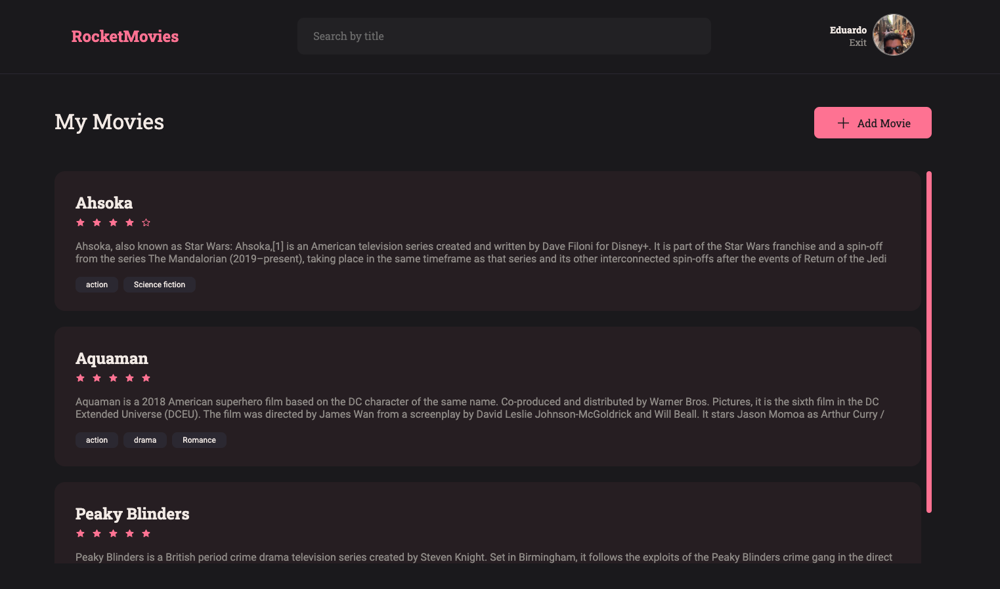
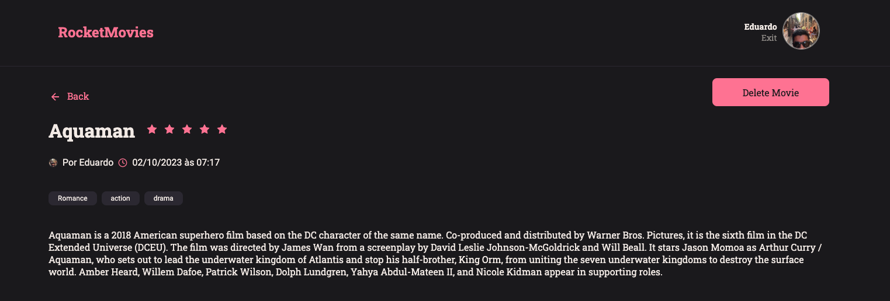
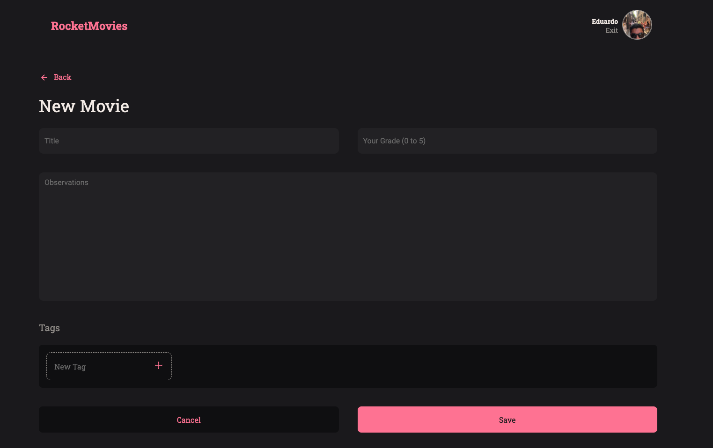

# Rocket Movies CRUD App

Welcome to **Rocket Movies**, a CRUD application that allows users to manage movie information. The project is divided into two main components: a backend API developed using Node.js, Express, and Knex, and a frontend built with React.js and Styled Components.

## Table of Contents

- [Introduction](#introduction)
- [Features](#features)
- [Technologies Used](#technologies-used)
- [Setup Instructions](#setup-instructions)
- [Usage](#usage)
- [Contributing](#contributing)
- [License](#license)

## Introduction

The **Rocket Movies** project is a simple CRUD (Create, Read, Update, Delete) application that allows users to manage movie data. The backend provides an API to perform CRUD operations on movie information, while the frontend enables users to interact with the data in a user-friendly interface.

## Features

- Create, Read, Update, and Delete movie information.
- Seamless integration between the backend API and the frontend UI.

## Technologies Used

- **Backend**:
  - Node.js: JavaScript runtime environment.
  - Express: Web application framework for Node.js.
  - Knex.js: SQL query builder for Node.js.
  
- **Frontend**:
  - React.js: JavaScript library for building user interfaces.
  - Styled Components: CSS-in-JS library for component styling.

## Setup Instructions
 
1. **Clone the Repository**:
   ```bash
   git clone https://github.com/eduaardofranco/rocket-movies.git
   cd rocket-movies
   ```
2. **Install Backend**:
   Go to repository [https://github.com/eduaardofranco/Movie_notes]
   ```bash
   git clone https://github.com/eduaardofranco/rocket-movies.git
   cd rocket-movies
   npm install
   ```

3. **Install Dependencies**:

   # Navigate to the frontend directory and install frontend dependencies
   ```
   cd ../frontend
   npm install
   ```

4. **Run the Application**:
   ```bash
   # Start the backend server (from the backend repository)
   npm run dev

   # Start the frontend development server
   npm  run dev
   ```

5. **Access the Application**:
   - The backend server will start on `http://localhost:3333`
   - The frontend development server will start on `http://localhost:5173`

## Usage

1. Navigate to the frontend application using a web browser.
2. Use the interface to perform CRUD operations on movie information.

Of course! Adding a section for screenshots can be very helpful for users to visualize the application. Here's how you can incorporate a "Screenshots" section in your README:


## Screenshots

Include screenshots of the application to provide a visual representation of the features and interface.

### Home Page



### Movie Details Page



### Add Movie Page




## License

This project is licensed under the [MIT License](LICENSE).


